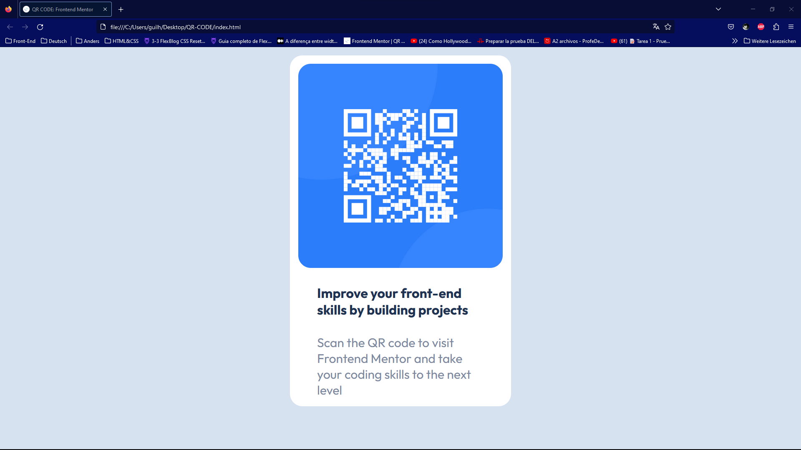

# Frontend Mentor - QR code component solution

This is a solution to the [QR code component challenge on Frontend Mentor](https://www.frontendmentor.io/challenges/qr-code-component-iux_sIO_H). Frontend Mentor challenges help you improve your coding skills by building realistic projects. 

## Table of contents

- [Overview](#overview)
  - [Screenshot](#screenshot)
  - [Links](#links)
- [My process](#my-process)
  - [Built with](#built-with)
  - [What I learned](#what-i-learned)
  - [Continued development](#continued-development)
- [Author](#author)
- [Acknowledgments](#acknowledgments)

## Overview

### Screenshot

### Links

- Live Site URL: [Live Site URL](https://almeida-guilherme.github.io/Qrcode-Frontend-Mentor/)

## My process

### Built with

- Semantic HTML5 markup
- CSS custom properties
- Flexbox

### What I learned

The thing I learned most, it was how to make a site responsive. It's easier just to make a site, that fits in my desktop.However, when I needed make a site, that it require to fit in an mobile screen, it was harder. Besides, I learned how to make something just looking the model. It was interesting, because before I made my pages just with a tutorial

-text-align

### Continued development

- Responsiveness
- Flexbox

## Author

- Frontend Mentor - [@guihenriquedev](https://www.frontendmentor.io/profile/guihenriquedev)
- Linkedin - [@Guilherme Henrique](https://www.linkedin.com/in/guilhermenrique/)
- Hackerrank - [@guilherme_3507](https://www.hackerrank.com/profile/guilherme_3507)

## Acknowledgments

I'd like to thank "Chriscent Pingol" [@KishonShrill], because he showed me how I could improve my code and my way of coding
